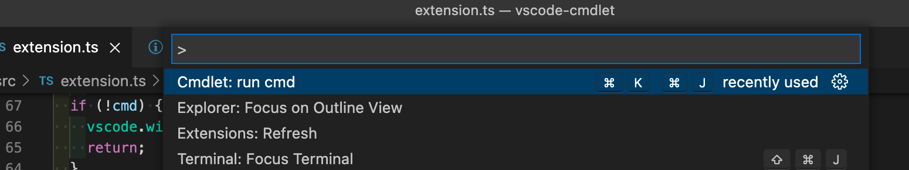
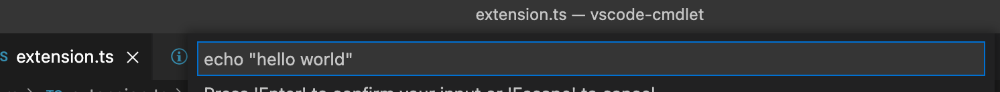
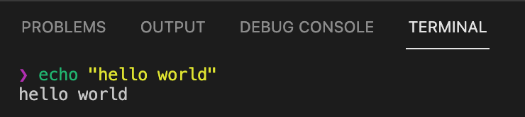
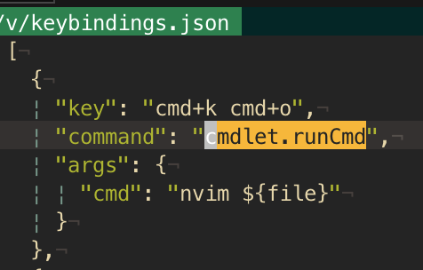
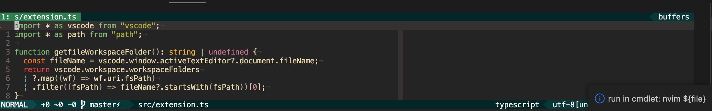

# cmdlet

Run a command in terminal with ease

## Features

### run from the Command Palette

### create keybindings

#### supported variables

##### builtins from https://code.visualstudio.com/docs/editor/variables-reference
- {workspaceFolder}
- {workspaceFolderBasename}
- {file}
- {fileWorkspaceFolder}
- {relativeFile}
- {relativeFileDirname}
- {fileBasename}
- {fileBasenameNoExtension}
- {fileDirname}
- {fileExtname}
- {cwd}
- {lineNumber}
- {selectedText}
- {execPath}
- {defaultBuildTask}
- {pathSeparator}

##### additonals
- ${wordUnderCursor}
- ${searchPhrase}
- ${openFiles}
- ${projectFolder}

## Release Notes

### 0.0.1

Initial release of cmdlet

### 0.0.2

Imporoved README

### 0.0.3

Icon

### 0.0.4

Dark icon
